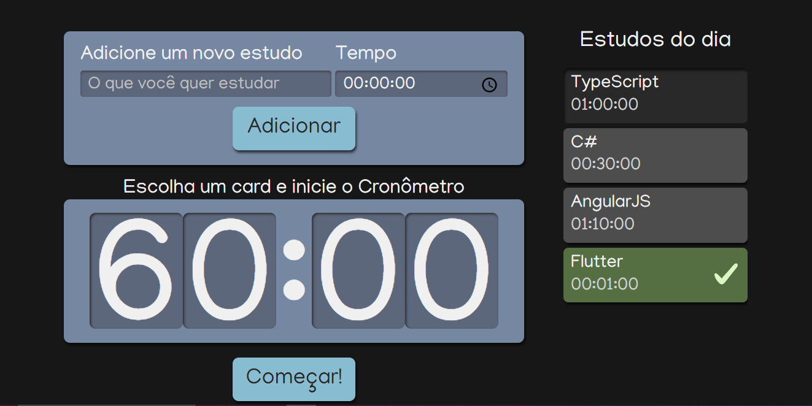

<!DOCTYPE html>
<html>
  <head>
  </head>
  <body>
    <h1>React: escrevendo com Typescript</h1>
    

    
    

    
Este repositório contém o código desenvolvido durante o curso de React: escrevendo com Typescript, oferecido pela Alura.

    
O curso tem como objetivo ensinar como escrever aplicações React usando a linguagem TypeScript. O TypeScript é um superset do JavaScript que adiciona recursos de tipagem estática ao JavaScript, tornando-o mais robusto e menos propenso a erros.

    
O curso é dividido em diversos módulos, abrangendo desde o básico do TypeScript até a construção de uma aplicação completa usando React e TypeScript. Alguns dos tópicos abordados incluem:

    <ul>
      <li>Introdução ao TypeScript</li>
      <li>Configuração do ambiente de desenvolvimento</li>
      <li>Tipos básicos do TypeScript</li>
      <li>Tipagem de objetos e arrays</li>
      <li>Funções e seus tipos</li>
      <li>Interfaces e tipos genéricos</li>
      <li>Componentes React com TypeScript</li>
      <li>Uso de hooks do React com TypeScript</li>
      <li>Rotas em aplicações React com TypeScript</li>
      <li>Consumindo APIs com TypeScript</li>
    </ul>
    <h2>Como usar este repositório</h2>
    
Cada pasta neste repositório representa uma etapa do curso, com o código desenvolvido até aquele momento. Para acompanhar o curso, basta clonar este repositório e checar o código correspondente ao módulo em que você está.

    <h2>Pré-requisitos</h2>
    
Para seguir este curso, é necessário ter conhecimentos básicos em JavaScript e React.

    <h2>Tecnologias utilizadas</h2>
    <ul>
      <li>TypeScript</li>
      <li>React</li>
      <li>React Router</li>
      <li>Axios</li>
    </ul>
    <h2>Como rodar o projeto</h2>
    
Para rodar o projeto, é necessário ter o Node.js e o Yarn instalados. Em seguida, siga os seguintes passos:

    <ol>
      <li>Clone o repositório:</li>
      <pre><code>https://github.com/Elizeu-Santos/Alura-Studies.git</code></pre>
      <li>Instale as dependências:</li>
      <pre><code>cd curso-react-typescript-alura
yarn</code></pre>
      <li>Rode o projeto:</li>
      <pre><code>yarn start</code></pre>
    </ol>
    
O projeto será executado no endereço http://localhost:3000.

  </body>
</html>

